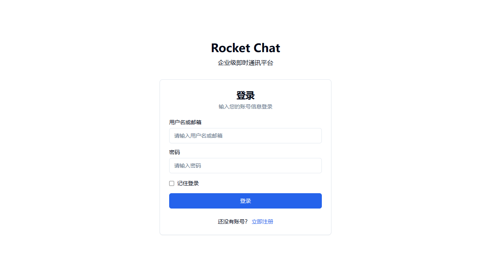
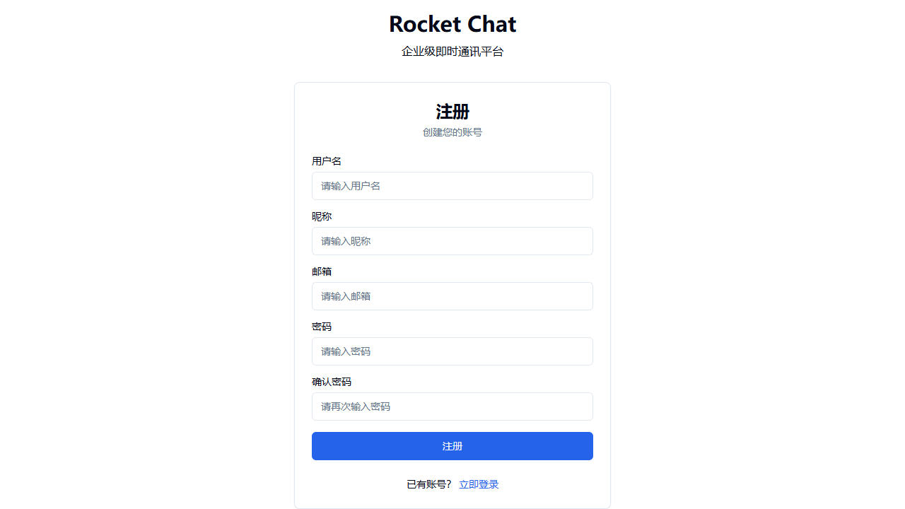
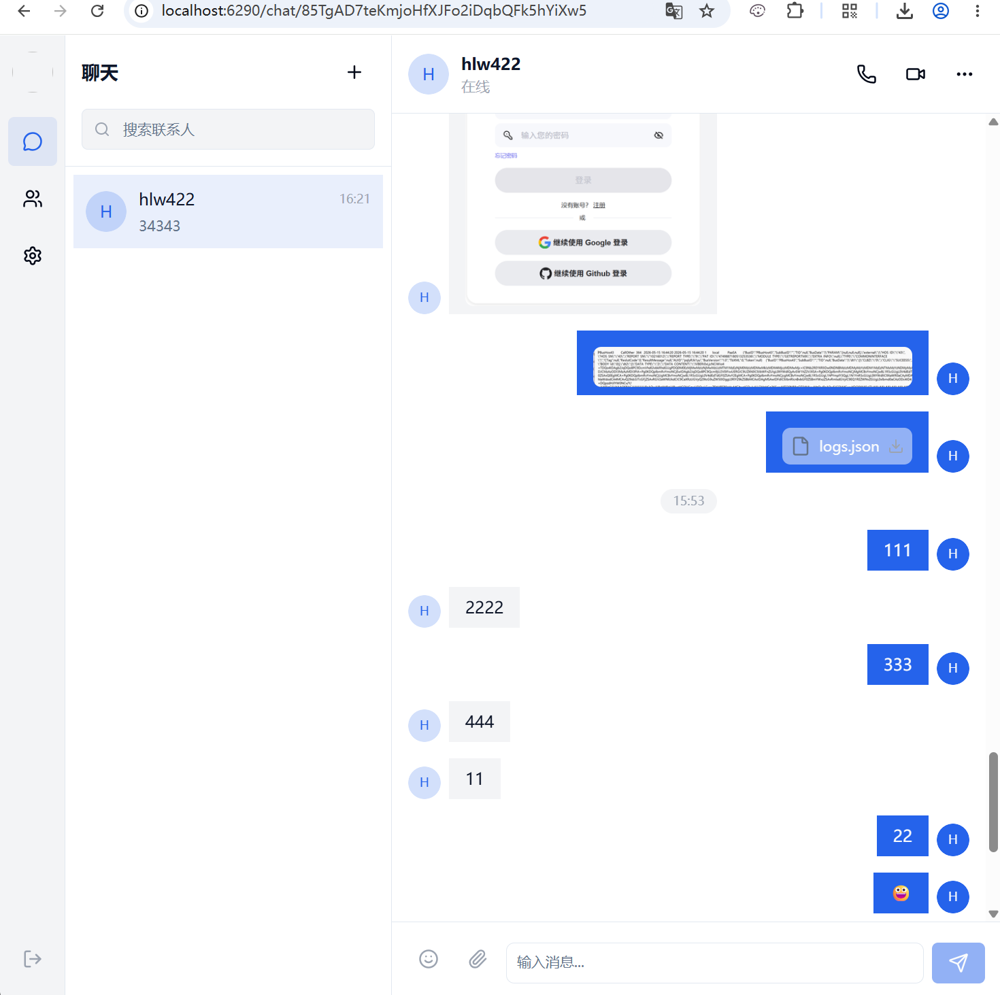
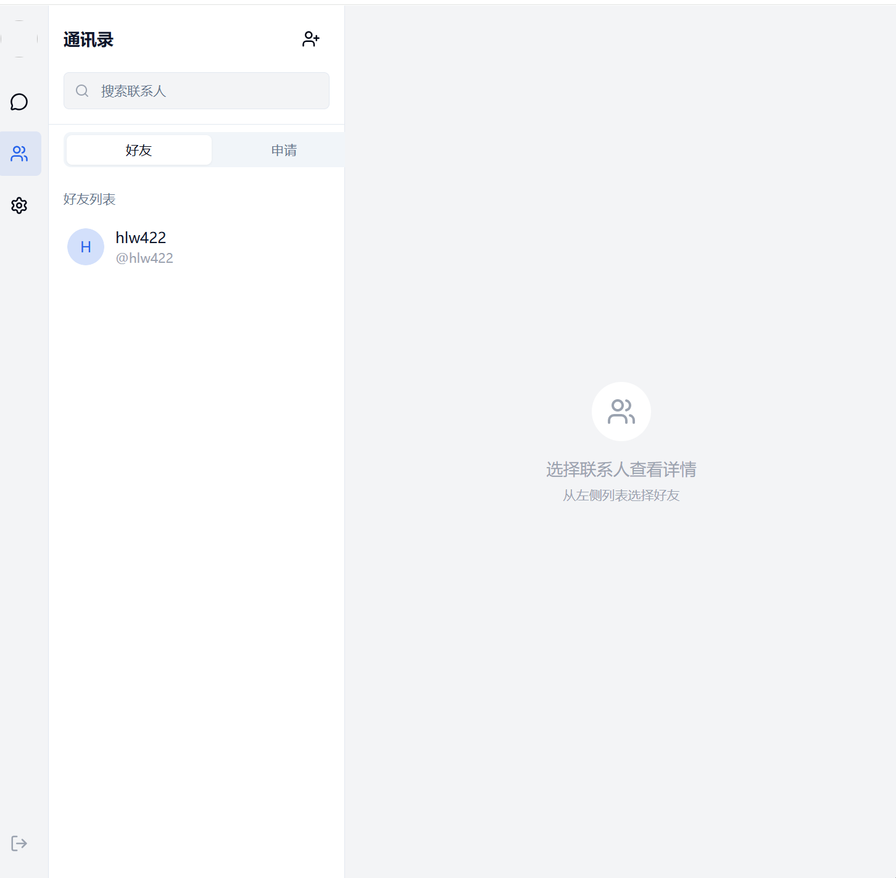

# Rocket.Chat Web Client

一个基于 React + TypeScript + Vite 构建的 Rocket.Chat Web 客户端。

## 界面预览

### 登录页面

### 注册页面

### 聊天

### 好友页面


## 功能特性

- 🔐 用户认证（登录/注册）
- 💬 实时聊天（基于 WebSocket）
- 👥 好友系统（添加/删除好友、好友请求）
- 😀 表情选择器
- 📎 文件上传（图片、音频、视频、文档）
- 🔔 消息通知
- 🌙 暗色主题支持
- 📱 响应式设计

## 技术栈

- **前端框架**: React 18 + TypeScript
- **构建工具**: Vite
- **状态管理**: Zustand
- **路由**: React Router v7
- **样式**: Tailwind CSS
- **HTTP 客户端**: Axios
- **实时通信**: WebSocket (Rocket.Chat DDP 协议)
- **UI 组件**: 自定义组件 + Lucide Icons

## 项目结构

```
src/
├── api/                    # API 接口层
│   ├── auth.ts            # 认证相关 API
│   ├── chat.ts            # 聊天相关 API
│   ├── file.ts            # 文件上传 API
│   ├── friend.ts          # 好友相关 API
│   ├── message.ts         # 消息相关 API
│   └── client.ts          # Axios 实例配置
├── components/            # 通用 UI 组件
│   └── ui/               # 基础 UI 组件（Button、Input、Avatar 等）
├── hooks/                 # 自定义 Hooks
│   └── useWebSocket.ts   # WebSocket 连接管理
├── layouts/               # 布局组件
│   ├── AuthLayout.tsx    # 认证页面布局
│   └── MainLayout.tsx    # 主页面布局
├── modules/               # 功能模块
│   ├── chat/             # 聊天模块
│   │   └── components/
│   │       └── ChatWindow.tsx
│   └── message/          # 消息模块
│       └── components/
│           ├── EmojiPicker.tsx
│           ├── MessageBubble.tsx
│           └── MessageSearch.tsx
├── pages/                 # 页面组件
│   ├── ChatPage.tsx      # 聊天页面
│   ├── ContactsPage.tsx  # 联系人页面
│   ├── LoginPage.tsx     # 登录页面
│   ├── RegisterPage.tsx  # 注册页面
│   └── SettingsPage.tsx  # 设置页面
├── router/                # 路由配置
│   └── index.tsx
├── services/              # 服务层
│   ├── storage.ts        # 本地存储服务
│   └── websocket.ts      # WebSocket 服务
├── stores/                # Zustand 状态管理
│   ├── authStore.ts      # 认证状态
│   ├── chatStore.ts      # 聊天状态
│   ├── friendStore.ts    # 好友状态
│   ├── messageStore.ts   # 消息状态
│   ├── notificationStore.ts # 通知状态
│   └── socketStore.ts    # WebSocket 状态
├── types/                 # TypeScript 类型定义
│   ├── api.ts
│   ├── message.ts
│   ├── room.ts
│   └── user.ts
├── App.tsx                # 应用入口
└── main.tsx               # 主入口文件
```

## 快速开始

### 环境要求

- Node.js >= 18
- npm >= 9

### 安装依赖

```bash
npm install
```

### 启动开发服务器

```bash
npm run dev
```

开发服务器将在 `http://localhost:6290` 启动。

### 构建生产版本

```bash
npm run build
```

### 预览生产版本

```bash
npm run preview
```

## 环境配置

### 后端服务器

默认配置下，前端会将 API 请求代理到 `http://192.168.1.189:3000`（Rocket.Chat 服务器）。

如需修改后端地址，请编辑 `vite.config.ts`：

```typescript
server: {
  proxy: {
    '/api': {
      target: 'http://your-rocket-chat-server:3000',
      changeOrigin: true,
    },
    '/websocket': {
      target: 'ws://your-rocket-chat-server:3000',
      ws: true,
      changeOrigin: true,
    },
  },
},
```

### 端口配置

默认端口为 `6290`，可在 `vite.config.ts` 中修改：

```typescript
server: {
  port: 6290,
},
```

## 主要功能说明

### 聊天功能

- 支持一对一私聊
- 实时消息推送（WebSocket）
- 消息已读状态
- 文件/图片发送
- 表情选择器

### 好友系统

- 搜索用户
- 发送/接受/拒绝好友请求
- 好友列表管理
- 用户屏蔽功能

### 认证系统

- 用户名/密码登录
- 新用户注册
- Token 自动刷新
- 会话保持

## 代理配置说明

项目使用 Vite 代理来解决跨域问题：

| 路径 | 目标 | 说明 |
|------|------|------|
| `/api` | `http://192.168.1.189:3000` | REST API 请求 |
| `/file-upload` | `http://192.168.1.189:3000` | 文件上传 |
| `/avatar` | `http://192.168.1.189:3000` | 用户头像 |
| `/websocket` | `ws://192.168.1.189:3000` | WebSocket 连接 |

## 开发指南

### 添加新页面

1. 在 `src/pages/` 创建新页面组件
2. 在 `src/router/index.tsx` 添加路由配置
3. 如需布局，在 `src/layouts/` 中选择或创建布局组件

### 添加新 API

1. 在 `src/api/` 创建新的 API 文件
2. 使用 `apiClient` 发送请求
3. 在对应的 Store 中调用 API

### 状态管理

使用 Zustand 进行状态管理，Store 位于 `src/stores/`：

- `authStore`: 用户认证状态
- `chatStore`: 聊天房间状态
- `messageStore`: 消息状态
- `friendStore`: 好友状态
- `notificationStore`: 通知状态
- `socketStore`: WebSocket 连接状态

## 常见问题

### 429 Too Many Requests

后端 Rocket.Chat 服务器触发了速率限制。解决方法：
- 等待一段时间后重试
- 检查是否有大量并发请求
- 调整后端速率限制配置

### WebSocket 连接失败

检查：
1. 后端 Rocket.Chat 服务器是否正常运行
2. WebSocket 代理配置是否正确
3. 网络是否通畅

### 消息不显示

检查：
1. 用户是否已登录
2. WebSocket 是否已连接
3. 是否已订阅对应的房间

## License

MIT
